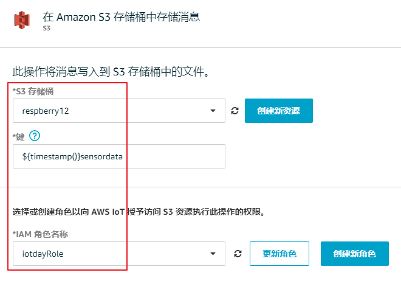

# IoT动手实验 - 树莓派控制

也许您的树莓派放在家里已经吃灰很久了，本实验带把树莓派用起来。指导我们如何一步步的在AWS 平台搭建自己的的物联网设备，主要使用树莓派加传感器，通过MQTT 协议把传感器信息上传到AWS IoT 平台，同时移动终端终端通过访问AWS IoT，实时获取传感器信息，进一步控制设备。


## 准备工作

需要硬件设备：

- 树莓派一个
- 树莓派电源
- 内存卡一张（至少8G）

除了以上吃灰设备，您可以在万能的X宝上轻松买到以下设备，我批量买入了十几套设备，每套成本算下来应该是5块钱。

- 一根二极管（一般都是一包买，本实验只需要用一根）
- 一个DHT11温湿度传感器（如果您对数据精确到有要求可以买DHT22）
- 面包板一个
- 杜邦线（两头母母）一排

如果您的树莓派还没有进行系统烧录，请根据树莓派官方指引进行操作：
https://www.raspberrypi.org/documentation/installation/installing-images/

本文实验使用的树莓派系统是：
https://downloads.raspberrypi.org/raspbian_lite_latest

登录您的AWS IAM 控制台，创建一个IAM User用于在树莓派上进行设备注册。AWS 访问类型是编程访问即可，创建完这个IAM User之后，记下访问密钥 ID，以及私有访问密钥。

此IAM User 需要以下权限

```json
{
    "Version": "2012-10-17",
    "Statement": [
        {
            "Sid": "VisualEditor0",
            "Effect": "Allow",
            "Action": [
                "iot:CreateThing",
                "iot:AttachThingPrincipal",
                "iot:AttachPrincipalPolicy",
                "iot:CreatePolicy",
                "iot:CreateKeysAndCertificate"
            ],
            "Resource": "*"
        }
    ]
}
```

## 设备注册

烧录完树莓派系统之后，把树莓接入网络，找到树莓派IP地址，并使用VNC 或者 SSH 登录到树莓派上。

树莓派默认 SSH 账号密码：

**用户名：pi**
**密码：raspberry**

登录到树莓派之后，安装Git

```
sudo apt-get install git
```

安装 AWS Cli

```
sudo pip install awscli
```

配置AWS Cli

```
aws configure
```

在输入框中输入您在准备工作中创建的AWS Access Key ID(访问密钥 ID)，以及(AWS Secret Access Key)私有访问密钥，Default region name（默认区域就是您需要使用AWS IoT 平台的区域，北京Region为： cn=north-1）,Default output format 为json。

下载设备端代码：

```
git clone https://github.com/cncoder/aws-iot-raspberrypi.git
```

切换到aws-iot-raspberrypi目录下的证书目录

```
cd aws-iot-raspberrypi/cert
```


## ************************** 非常重要提示*********************************

## **确保每次输入的事物名称（Thing Name）前后一致 （raspberryXX）**

## ************************** 非常重要提示*********************************


创建安全策略(**raspberryXX**):

策略名称，事物名称中输入**raspberryXX** **，**事物命名规则为raspberryXX, XX随机两位数字就可以了，假设是在实际生产中的序列号。

```
aws iot create-policy --policy-name "raspberryxx" --policy-document '{"Version": "2012-10-17","Statement": [{"Effect": "Allow","Action": "iot:*","Resource": "*"}]}'
```

创建设备影子(您可以理解为真实物理设备在云上的 一个影子或者映射)：

```
aws iot create-thing --thing-name  "raspberryXX" 
```

使用AWS Cli创建设备证书，激活并记录控制台返回的证书 ARN (certificateArn)

```
aws iot create-keys-and-certificate --set-as-active --certificate-pem-outfile certificate.pem --private-key-outfile private.pem.key | grep certificateArn
```

为证书附加安全策略和设备影子，这里的—principal替换成上一步记录下来的证书ARN, --policy-name使用您自己的编号

```
aws iot attach-principal-policy --policy-name "raspberryXX" --principal arn:XXXXX:XXXXX:cert/XXXXXXXX
```

```
aws iot attach-thing-principal --thing-name "raspberryXX" --principal arn:XXXXX:XXXXX:cert/XXXXXXXX
```

下载 AWS IoT 平台 CA 证书

```
wget -cO- https://www.symantec.com/content/en/us/enterprise/verisign/roots/VeriSign-Class%203-Public-Primary-Certification-Authority-G5.pem > rootCA.cert
```

完成这一节后，您会在本地cert 文件中看到三个文件(certificate.pem, private.pem.key和rootCA.cert)，这三个文件将用于后续连接到AWS IoT平台。此外，还可以在AWS IoT 控制台看到您所创建的证书，安全策略，设备影子。AWS 为不同需求的客户提供了不同的解决方案，在实际生产中，您可以选用熟悉的编程语言SDK，根据自己的情况使用不同的设备注册方式。

## 把传感器和二极管接入到树莓派

* 首先介绍一下DHT11：

DHT11是一个温湿度传感器，分为3个接口，分别为：VCC（+ 正极）, DATA, GND（- 负极）

VCC | 电源| +级，输入3V-5.5V|

DATA | 数据输出| 输出引脚|

GND | 接地 | -级别，接地引脚|


DHT11接线说明

1. VCC接上3V3，可以选择1口或者17口
2. DATA接上GPIO口，我选的是**GPIO2**，第3口
3. GND接上接地口，我选的是第14口


把二极管接入到**GPIO3**


请注意二极管分为正负极，长的一端为正极，短的一端为负极。

## 把树莓派接入到AWS IoT

完成以上设备注册操作之后，就可以使用MQTT 连接到AWS IoT了。之后就可以远程看到本地传感器设备的状态了，甚至通过web 界面控制二极管开关。

首先切换到 aws-iot-raspberrypi 目录

```
cd ..
```

安装AWS IoT SDK

```
sudo pip install AWSIoTPythonSDK
```

修改连接文件配置，我们通过vim 来编辑这个文件

```
vi ThingShadowAgent.py
```

endpoint：登录您的 AWS IoT 控制台(https://console.amazonaws.cn/iot/home?region=cn-north-1#/settings)， 选择左边的设置，页面中的终端节点就是endpoint，对于每个AWS 账户这是唯一的。

thingName：**raspberry<组号>（上述注册设置的组名）**

topic：”**raspberry<组号>/sensor/data”**

运行连接文件

```
python ThingShadowAgent.py
```

此时您可以看到树莓排有大量输出，并提示已经连接成功，发送MQTT数据了。

现在我们可以通过AWS IoT 控制台，到事物影子查看树莓派上传到AWS IoT平台数据 。

1. 打开AWS IoT 控制台
2. 选择左边管理 => 事物
3. 点击您在上一节中创建的事物影子


## 设置规则引擎(可选)

在本次实验中，您会发现传感器上传某些时间点数据和和室内温度、空气湿度数据明显不一致，这是因为传感器的一些干扰数据并没有过滤，如果看回到树莓派输出，您会发现树莓派本地输出会把这些错误数据打印出来了，并提醒为wrong。我们充分利用这些错误的数据，在AWS上，使用IoT + 数据分析功能，把这些标识出来，进一步体现数据分析的实用性，重要性。

在前面一节”把树莓派接入到AWS IoT“，我们已经通过topic 把传感器数据发到AWS IoT 平台，现在，我们把这些传感器数据存储到S3 ，以便后续数据分析。

1. 打开AWS IoT 控制台 (https://console.amazonaws.cn/iot/home?region=cn-north-1#/dashboard)
2. 选择左边菜单栏的行动，您将看到规则页面
3. 选择创建规则
4. 名称：raspberry<组号>，描述可以留空不填
5. 属性：*
6. 主题筛选条件："raspberry<组号>/sensor/data"（示例：raspberry01/sensor/data）
7. 选择添加操作，在下一屏幕中选择 "在 Amazon S3 存储桶中存储消息"，然后点击配置操作进入下一步
8. 选择创建新资源会跳到S3控制台页面，然后选择页面中“创建的存储桶”，在页面输入raspberry<组号>作为您唯一的存储桶，之后返回IoT 控制台页面，点击页面中的刷新按钮，选择您刚刚创建的存储桶
9. *键一栏输入：${timestamp()}sensordata
10. IAM 角色选择“创建一个新角色” 
11. 最后确认无误点击右下方添加操作



配置完成之后，稍等片刻即可在您创建的S3存储桶中查看到上传上来的数据。之后您可以充分使用AWS 数据分析服务，并充分使用数据湖进行分析，例如AWS EMR，Elasticsearch，Redshift 等服务进行数据分析。在本实验中不一一展开说明。

## 远程查看传感器数据并控制设备

启动一台AWS EC2，Linux或者Windows Server 都可以，并在安全组打开80以及22端口，安装Nodejs 环境。以下笔者启动的是一台Amazon Linux，安装Nodejs 步骤：

我们将使用 nvm 来安装Node.js，而且 nvm 可以安装多个版本的 Node.js 并允许您在它们之间切换。

```
curl -o- https://raw.githubusercontent.com/creationix/nvm/v0.33.8/install.sh | bash
```

在命令行键入以下命令来激活 nvm

```
. ~/.nvm/nvm.sh
```

安装Node.js 8 版本

```
nvm install 8
```

通过在命令行输入以下内容来测试Node.js是否已正确安装并正常运行。

```
node -e "console.log('Running Node.js ' + process.version)"
```

下载Web页面控制代码，并安装依赖

```
git clone https://github.com/cncoder/webserver-iotCtl-raspberrypi.git

cd webserver-iotCtl-raspberrypi

npm install
```

我们建议您为每个设备或者服务器提供一个唯一的证书，以便进行精细的管理，包括证书吊销。所以在这一节中，也需要注册设备并设置好证书，最后把证书放到cert目录。同样的您可以使用第一节的方法注册证书。
创建安全策略(**raspberryXX**):

策略名称输入webserver，在此服务器不需要创建事物。

```
aws iot create-policy --policy-name "webserver" --policy-document '{"Version": "2012-10-17","Statement": [{"Effect": "Allow","Action": "iot:*","Resource": "*"}]}'
```

使用AWS Cli创建设备证书，激活并记录控制台返回的证书 ARN (certificateArn)

```
aws iot create-keys-and-certificate --set-as-active --certificate-pem-outfile certificate.pem --private-key-outfile private.pem.key | grep certificateArn
```

为证书附加安全策略，不需要附加设备影子了，这里的—principal替换成上一步记录下来的证书ARN, --policy-name使用您自己的编号

```
aws iot attach-principal-policy --policy-name "webserver" --principal arn:XXXXX:XXXXX:cert/XXXXXXXX
```

下载 AWS IoT 平台 CA 证书

```
wget -cO- https://www.symantec.com/content/en/us/enterprise/verisign/roots/VeriSign-Class%203-Public-Primary-Certification-Authority-G5.pem > rootCA.cert
```

编辑 mobileserver.js 文件，修改其中thingname，以及endpoint。

**thingname: 'raspberryXX'**

**host: 'XXXX.iot.cn-north-1.amazonaws.com.cn'**


保存并运行mobileserver.js 文件

```
node mobileserver.js
```

此时您可以通过电脑浏览器访问您服务器的ip地址，进行远程查看传感器数据并控制设备了。

